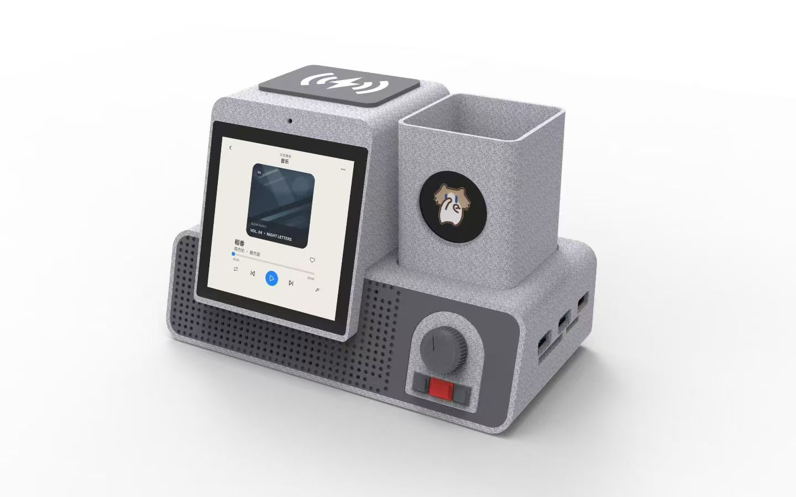
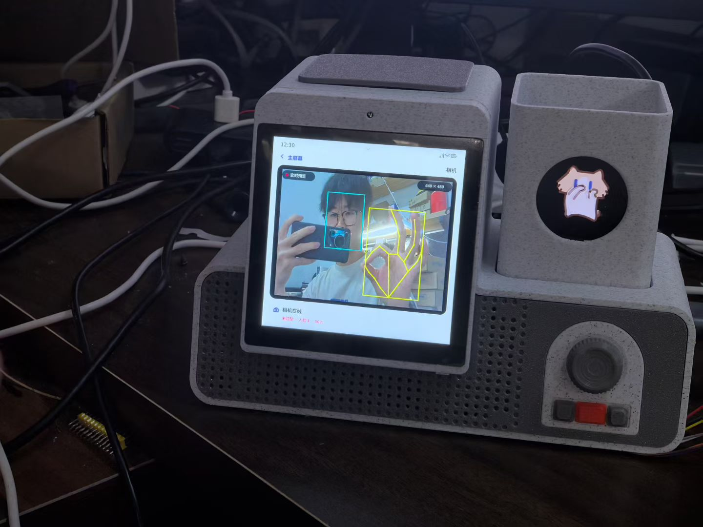
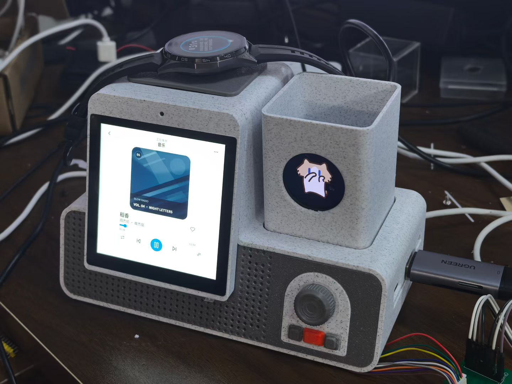
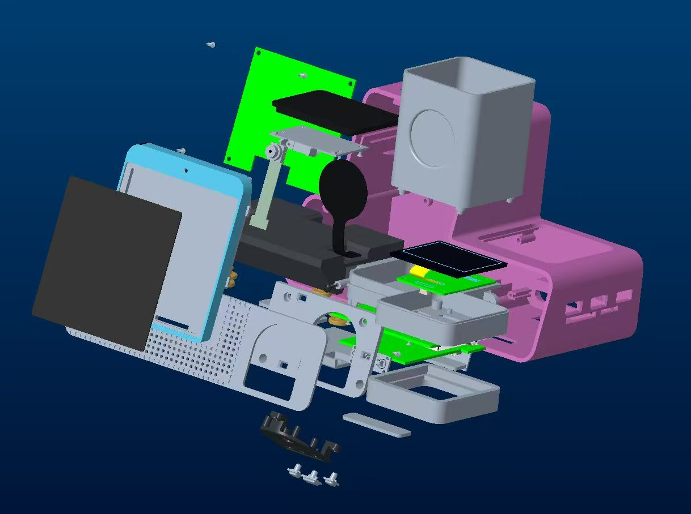

# BinBot

<p align="center">
  
</p>

<p align="center">
  <strong>基于 Rockchip RV1106 的开源 AI 桌面助手与桌面屏设备</strong>
</p>

BinBot 是一个软硬件结合的桌面 AI 设备项目。它把电脑开机、USB 和存储卡扩展、
手机充电、音频播放、语音交互和桌面陪伴集中到一个设备中，同时保留可扩展的
AI Agent、视觉识别和模块化硬件接口。

项目的出发点很简单：电脑主机通常放在桌面下方，开机、插 U 盘、读取存储卡和
连接音箱都需要弯腰或在一堆线材中寻找接口。BinBot 希望把这些高频操作放回手边，
再通过屏幕、声音、旋钮、实体按键和振动提供自然的反馈。

## 项目特点

- 4 英寸 720 x 720 触控屏和 LVGL 图形界面
- 基于 Rockchip RV1106 Linux 的嵌入式设备运行时
- 本地唤醒词、语音交互和可扩展的 AI Agent
- 电脑远程开机、状态同步和桌面端控制
- USB HID 输入，可通过旋钮和按键控制电脑音量、播放和快捷键
- USB 3.0、SD 卡、TF 卡、USB 充电和顶部无线充电
- 本地音乐、蓝牙音箱、番茄钟、白噪音和桌面信息展示
- 摄像头预览、本地视觉推理、手势和目标检测
- 屏幕、音箱和振动组合反馈，以及设备之间的远程互动
- 可通过磁吸触点更换笔筒、圆屏、全息显示和其他扩展模块

## 设计概览

### 一台设备解决桌面上的多个问题

BinBot 将原本分散的桌面设备组合到一个位置：

- 通过电脑内部的远程开机卡，模拟机箱电源键，实现桌面或手机远程开机。
- 通过 USB Hub 板提供 USB 3.0、SD 卡和 TF 卡接口，减少桌面线材和转接器。
- 通过顶部无线充电区域和 USB 接口为手机充电。
- 通过屏幕、音箱、旋钮、按键和振动提供统一的操作与反馈。

### 模块化硬件

整机采用横向布局，正面集中放置屏幕、旋钮和实体按键，侧面提供 Type-C 和 HDMI
接口，顶部为无线充电区域。内部由主控板、USB Hub 板、按键板和无线充电板组成。

右侧扩展位使用磁吸定位和触点连接电源、通信，主机无需改变即可更换不同模块：

- 笔筒模块：增加独立圆屏，用于显示表情、动画、时间和设备状态。
- 全息显示模块：通过三棱镜反射实现悬浮显示效果。
- 植物模块：作为桌面摆件，也为后续传感器和交互模块预留空间。

## 产品展示

| 产品效果图 | 实机视觉功能 |
| --- | --- |
|  |  |

| 实机音乐界面 | 产品爆炸结构 |
| --- | --- |
|  |  |

## 硬件规格

| 部分 | 内容 |
| --- | --- |
| 主控 | Rockchip RV1106，Linux，支持本地 AI 推理 |
| 显示与交互 | 4 英寸 720 x 720 屏幕、旋钮、实体按键、振动电机 |
| 扩展接口 | 2 x USB 3.0、USB 充电接口、SD 卡、TF 卡、2 x Type-C、HDMI |
| 音频 | 本地音频播放、扬声器、Bluetooth Classic A2DP Sink |
| 摄像头 | RGB 接口摄像头，支持本地视觉模型扩展 |
| 主板 | 4 层 PCB，面向 USB 3.0 和 eMMC 的高速信号设计 |
| 电脑连接 | Type-C 数据与视频扩展、USB HID、远程开机卡 |
| 充电 | 顶部无线充电区域和 USB 有线充电 |

## 软件能力

设备端软件围绕 Linux 主控拆分为多个服务，负责图形界面、音频、唤醒、摄像头、
输入设备、振动反馈和网络通信。软件能力包括：

- 通过屏幕和旋钮操作音乐、番茄钟、白噪音、单词学习和设备设置。
- 通过 Bluetooth Classic 接收手机或电脑的音频，作为蓝牙音箱使用。
- 通过 USB HID 向电脑发送音量、播放控制、截屏和自定义快捷键。
- 通过电脑端 Python 服务读取电脑状态，并把状态同步到设备。
- 通过文字、语音或手机 App 向硬件 Agent 发送指令，由 Agent 调用远程开机、
  电脑控制、番茄钟和白噪音等工具。
- 使用 RV1106 本地 NPU 运行视觉模型，支持手部、手势和目标检测等能力。
- 通过 Wi-Fi 连接多台设备，实现状态同步和“拍一拍”等远程互动。

## 仓库结构

```text
00_Image/              产品渲染图、实机照片和展示图片
01_3D_MD_ME_Binbot/   3D 模型、机械设计和电子设计资料
02_Software_Binbot/   设备端软件、服务端和控制台
03_Hardware_Binbot/   硬件资料、板级支持和硬件文档
```

## 系统组成

```text
桌面设备（RV1106）
  ├── LVGL UI、旋钮、按键、振动和音频
  ├── 摄像头与本地视觉推理
  ├── USB Hub、USB HID、无线充电和远程开机
  └── Wi-Fi / Bluetooth
          │
          ├── 电脑端服务：电脑状态、控制和快捷操作
          ├── 手机 App：远程控制和设备互动
          └── AI Agent 服务：语音、文字、工具和多设备通信
```

## 开源进度

当前版本先公开 BinBot 的产品图片和项目目录结构。3D、软件和硬件资料会按目录
逐步整理并发布，发布内容会同时补充对应的构建方法、使用说明和第三方许可信息。

目前仓库中的图片包括产品渲染图、实机运行图和爆炸结构图；它们用于展示设备的
外观、交互界面和内部模块布局。

不同模型、硬件 SDK、字体、图标和媒体资源可能使用不同的许可证。使用或重新分发
完整设备镜像前，请阅读对应目录中的许可文件和 NOTICE；设备凭据和部署环境配置
不会放入仓库。

## 参与项目

欢迎通过 Issues 反馈问题、提出功能建议，或提交与硬件设计、嵌入式软件、界面和
AI 能力相关的改进。项目资料会随着硬件和软件版本逐步完善。

## License

项目许可证和第三方许可清单将在对应源代码和资料公开时补充。第三方组件继续遵循
其各自目录中附带的许可证。
